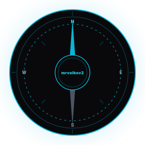

# Привет! Я Сергей 👋 (Siarhei Volkau)

**Fullstack Developer & Software Engineer**  
Инженер по профессии, увлеченный созданием современных, быстрых и адаптивных веб-приложений, а также разработкой цифровых продуктов «под ключ». Специализируюсь на веб-разработке, продуманной архитектуре приложений и автоматизации.

---

## 🚀 Мои проекты & Продукты

* **[CodLod Studio](https://codlod.com)** — собственная веб-студия и брендинг цифровых решений.
* **[MyRating Autos](https://myrating.autos)** — автомобильный рейтинговый портал (Next.js, Supabase, Vercel), разработанный с использованием современных веб-технологий.
* **[MyRating Autos Bot](https://t.me/myrating_autos_bot)** — автономный Telegram-бот для удобного взаимодействия с автомобильным порталом и расчёта рейтингов.
  
---

## 🛠️ Стек технологий & Инструменты

<!-- Frontend -->

 
<!-- Backend & DB -->

 
<!-- Mobile, DevOps & AI -->

* **Frontend:** Семантическая верстка, современные CSS-фреймворки (Tailwind CSS), разработка SPA (Next.js, React) и кроссплатформенных мобильных приложений (React Native).
* **Backend & BaaS:** Создание REST API на Node.js (Express), интеграция облачных архитектур и баз данных (Supabase, PostgreSQL, MongoDB).
* **Инструменты & Деплой:** Git, Docker, Vercel, GitHub Pages, Cloudflare.
* **Автоматизация & Скорость:** Разработка ботов (Telegram), интеграция ИИ-инструментов в разработку, уверенное владение слепым методом печати (ENG/RUS).

---

## 🏊‍♂️ Хобби & Интересы

Когда я не пишу код на любимом диване, меня можно найти здесь:
* **Циклический спорт:** Увлекаюсь бегом, плаванием и триатлоном (активно тренируюсь и готовлюсь к стартам на открытой воде).
* **Велосипед:** Люблю кататься на MTB и самостоятельно заниматься его обслуживанием.
* **Science:** Интересуюсь физикой, космологией и новостями космонавтики.

---

## 📊 GitHub Статистика (Code. Deploy. Repeat.)

  

  
  

---

## 🌌 Карта созвездий (Контрибьюции).

  

